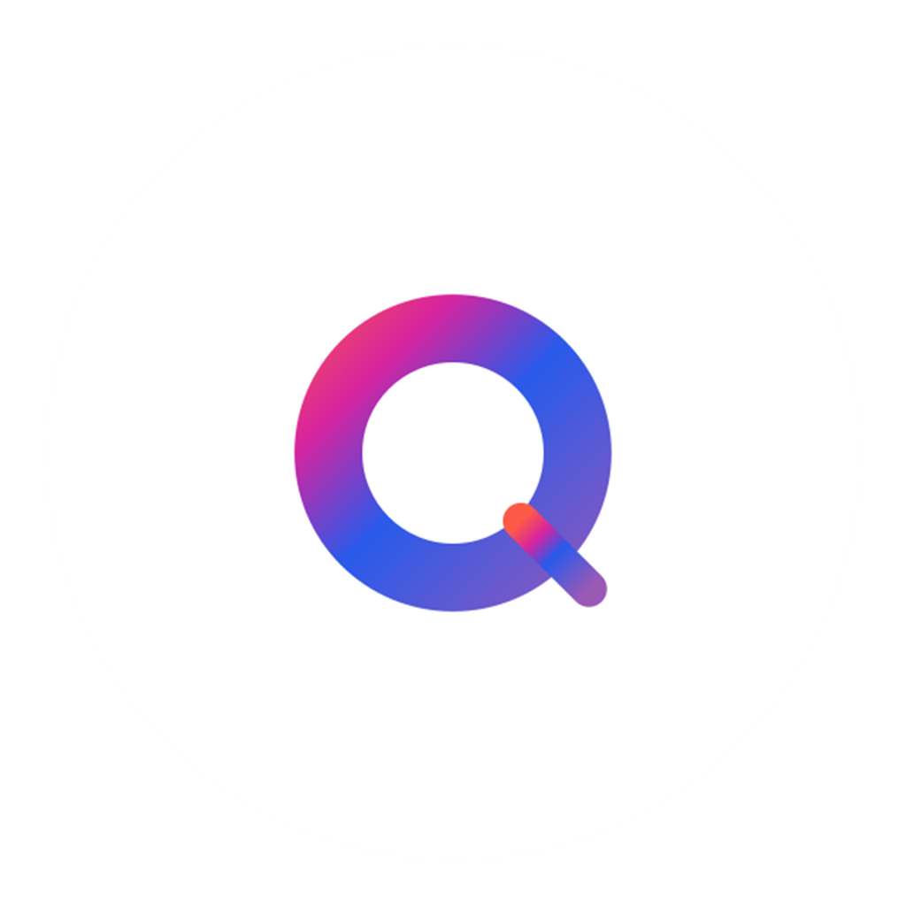

# 👋👋 Greetings, I'm Abdulwahab Alnemer

**Software Engineering Graduate | Full-Stack Developer | Exploring Cybersecurity**

📧 [alnemerabdulwahab@gmail.com](mailto:alnemerabdulwahab@gmail.com)  
🌐 **Portfolio:** [alnemerabdulwahab.github.io](https://alnemerabdulwahab.github.io/)

---

## 👤 About Me

Software Engineering graduate with a strong foundation in software development, networking, operating systems, and cloud infrastructure.
**CompTIA Network+, Security+, Server+, and Cloud+** certified, demonstrating solid knowledge of network infrastructure, system security,
server environments, and cloud fundamentals. Experienced in **C# and Java**, with hands-on development using **.NET and React**. Motivated to
build reliable and secure systems, with a growing focus on infrastructure and cybersecurity, and a strong commitment to continuous learning..

🔗 **[View My Portfolio](https://alnemerabdulwahab.github.io/)** for projects, certifications, and more!

---

## 🎓 Education

### Bachelor of Science in Software Engineering (BSSE)
**Florida Institute of Technology** | *Aug 2020 - Dec 2024*  
Dean's List (2021)

**Key Coursework:**
- **Software Development:** Java Programming, C++, Python, Web Development, Object-Oriented Design
- **Systems & Security:** Networks, Operating Systems, Computer Organization & Architecture
- **Software Engineering & Data:** Database Management Systems, Software Engineering Process Management, Data Structures
- **Computer Science:** Algorithms, Automata Theory

---

## 💼 Current Experience

### Information Technology - Software Development Bootcamp
**Tuwaiq Academy** · *Trainee*  
Sep 2025 - Jan 2026

Graduated from a competitive 16-week intensive bootcamp focusing on:
- ✅ Full-Stack Development using **Microsoft .NET, ASP.NET Core, and C#**
- ✅ Software Engineering principles: **SDLC and Git**
- ✅ Hands-on projects and real-world industry-level tasks
- ✅ Enrolled in **five professional certification courses**: PeopleCert ITIL v4, CompTIA Network+, Security+, Server+, Cloud+

---

## 💻 Technical Skills

### Programming Languages

### Web & Mobile Development

### Tools & Technologies

### Areas of Expertise
- 🌐 **Networking & Systems:** Operating Systems, Computer Networks
- 📁 **Databases:** SQL, Firebase
- 🔒 **Cybersecurity:** Fundamentals and best practices

---

## 🏆 Projects

###  Wasiyah (منصة وصية) - Digital Inheritance Platform
**Tuwaiq Academy (Graduation Project)** | *Jan 2026*

A secure GovTech/FinTech web application designed to digitize the traditional inheritance process.

**Technologies:** ASP.NET Core MVC, C#, SQL Server, Entity Framework, Bootstrap 5

**Key Features:**
- 🏛️ **Government Integration:** Simulation of automated will execution via Civil Affairs API triggers.
- 🔐 **Advanced Security:** Role-Based Access Control (RBAC) and strict data isolation.
- 📜 **Digital Drafting:** Secure creation, editing, and legal certification of wills.
- 👥 **Smart Address Book:** Complex Many-to-Many architecture for managing beneficiaries independently.

🔗 **[Project Showcase](https://github.com/AlnemerAbdulwahab/WasiyahApp-Showcase)**

---

###  SubsTrack - Subscription Management App
**Florida Institute of Technology** | *Aug 2023 - May 2024*

A comprehensive mobile application for tracking and managing subscriptions.

**Technologies:** React Native, JavaScript, Figma

**Key Features:**
- 📊 Centralized dashboard for all user subscriptions
- 🔔 Intelligent renewal reminder system with customizable notifications
- 💰 Cost tracking and budgeting tools
- 📈 Clear overview of billing dates and expenses

🔗 **[Project Showcase](https://github.com/AlnemerAbdulwahab/Substrack-App-Showcase)**

---

###  Qudratak - Qiyas Qudrat Exam Practice App
**Independent Project - Vibe Coding** | *Aug 2024 - Sep 2024*

Mobile exam preparation app designed for Saudi high school students.

**Technologies:** React Native, JavaScript, Figma

**Key Features:**
- ❓ Randomized question generation with instant scoring
- 📊 Performance tracking and progress monitoring
- 🎨 User-friendly interface tailored for students
- 📱 Cross-platform support (iOS & Android)
- ⚡ Delivered functional prototype within one week

🔗 **[Project Showcase](https://github.com/AlnemerAbdulwahab/Qudratak-App-Showcase)**

---

## 📚 Training Courses

| Course | Type | Issuer | Date |
|--------|------|--------|------|
| 🎓 **PeopleCert ITIL 4 Foundation**  | ITIL4FND-Ex Training | Tuwaiq Academy | Sep 2025 |
| 🌐 **CompTIA Network+**  | N10-009 Training | Tuwaiq Academy | Sep 2025 |
| 🔒 **CompTIA Security+**  | SY0-701 Training | Tuwaiq Academy | Oct 2025 |
| ☁ **CompTIA Cloud+**  | CV0-004 Training | Tuwaiq Academy | Oct 2025 |
| 🖥️ **CompTIA Server+**  | SK0-005 Training | Tuwaiq Academy | Oct 2025 |

---

## 📜 Professional Certifications

| Certificate | Version | Issuer | Valid Until |
|-------------|---------|--------|-------------|
| 🌐 **CompTIA Network+** | N10-009 | CompTIA | Nov 2028 |
| 🔒 **CompTIA Security+** | SY0-701 | CompTIA | Nov 2028 |
| 🖥️ **CompTIA Server+** | SK0-005 | CompTIA | Dec 2028 |
| ☁ **CompTIA Cloud+** | CV0-004 | CompTIA | Dec 2028 |
| 🌐🖥️ **CompTIA Network Infrastructure Professional - CNIP** | CNIP | CompTIA | N/A |
| ☁🖥️ **CompTIA Cloud Admin Professional - CCAP** | CNIP | CompTIA | N/A |
| 🌐☁ **CompTIA Secure Cloud Professional - CSCP** | CNIP | CompTIA | N/A |

🏅 **[View All Certifications](https://alnemerabdulwahab.github.io/#certifications)**

---

## 📫 Connect With Me

---

  
💼 Open to opportunities in software development and cybersecurity

  
🚀 Always learning, always building

